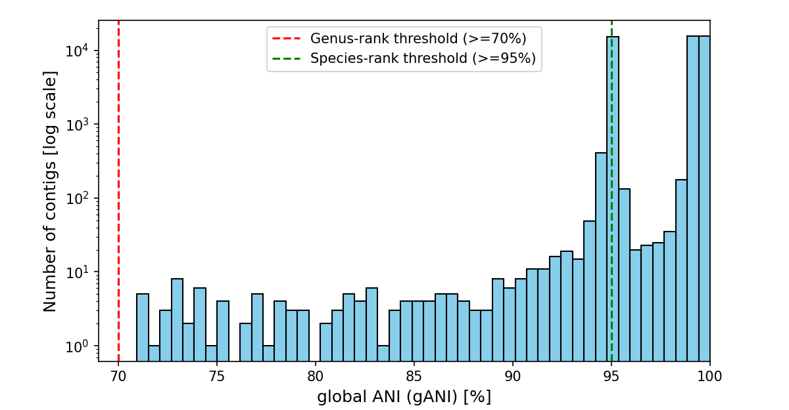

# ICTV-TaxonomyChallenge-Vclust

[](https://doi.org/10.5281/zenodo.14543274)

This repository contains the results and reproducibility code for applying [Vclust](https://github.com/refresh-bio/vclust) to the [ICTV Taxonomy Challenge](https://ictv-vbeg.github.io/ICTV-TaxonomyChallenge/). Vclust classified ~79% of the challenge contigs to species or genus ranks based on nucleotide sequence identity. Contigs with nucleotide identities below the genus-level threshold were excluded, as Vclust is designed to provide taxonomic annotations only down to the genus and species ranks. Excluded contigs were not assigned speculative higher taxonomic levels.

Results are available in **[results/vclust_results.tsv](./results/vclust_results.tsv)**.

## Table of Contents

1. [Methods](#1-methods)
   1. [Input data](#11-input-data)
   2. [Analysis](#12-analysis)
2. [Results](#2-results)
3. [Reproducing the results](#3-reproducing-the-results)
   1. [System and software requirements](#31-system-and-software-requirements)
   2. [Step-by-step instructions](#32-step-by-step-instructions)
4. [License](#4-license)
5. [References](#5-references)

## 1. Methods

### 1.1. Input data
The reference dataset includes 19,754 viral genome sequences from the ICTV Taxonomy Release [MSL39.v4](https://ictv.global/sites/default/files/VMR/VMR_MSL39.v4_20241106.xlsx), combined with 59,907 challenge contigs. The resulting multifasta file contains 79,661 sequences.

### 1.2. Analysis
Vclust v1.3.0 was used to classify challenge contigs by calculating the global Average Nucleotide Identity (gANI) against reference genomes with known ICTV taxonomy. Each contig was classified based on the highest gANI match to a reference genome using the following thresholds:

* gANI ≥ 95%: Species level
* gANI ≥ 70%: Genus level
* gANI < 70%: Excluded from classification


## 2. Results
Out of 59,907 challenge contigs, 47,264 were taxonomically classified down to species or genus levels. Only two contigs were classified to the family level, as the genus of the most similar reference genome was uknown. The [results/vclust_results.tsv](./results/vclust_results.tsv) file contains 31 tab-separated columns, including the challenge contig ID. For each contig in the results file, the last predicted taxonomic rank has a score ranging from 0.7 to 1.0, which represents the gANI (Global Average Nucleotide Identity) to its most similar reference genome.

| Taxonomic rank | Number of contigs | Unique taxon names |
| :---: | --- | --- |
| **Species**    | 44,315 | 10,910 |
| **Genus**    | 2,947 | 993 |
| **Family**    | 2 | 1 |
| Unclassified    | 12,643 | - |

The distribution of gANI values for the classified challenge contigs is shown below:



## 3. Reproducing the results

Reproducing the results takes ~10 minutes on a standard workstation. In our tests, Vclust completed the analysis in ~6 minutes on an Intel® Xeon® W-2295 CPU (3.00 GHz) using 16 GB RAM and 32 threads.

### 3.1. System and software requirements

To run Vclust and reproduce results, ensure the following requirements:

* **Operating system**: Linux or macOS
* **RAM memory**: At least 16 GB
* **Hard disk space**: Approximately 3 GB
* **Python version**: 3.8 or later
* **Python dependencies**:
   - `vclust==1.3.0`
   - `numpy`
   - `pandas`

### 3.2. Step-by-step instructions

Follow the steps below to reproduce the Vclust results:

#### 3.2.1. Clone this repository

Clone this repository and navigate to the directory:

```bash
git clone https://github.com/aziele/ICTV-TaxonomyChallenge-Vclust.git
cd ICTV-TaxonomyChallenge-Vclust
```

#### 3.2.2. Set up a Python virtual environment (optional)

(Optional) Create a virtual environment:

```bash
python -m venv venv
source venv/bin/activate
```

#### 3.2.3. Install Vclust and dependencies

Install Vclust and required Python dependencies:

```bash
pip install vclust==1.3.0 numpy pandas
```

#### 3.2.4. Download and extract the ICTV Challenge dataset

Download and extract the ICTV Taxonomy Challenge dataset:

```bash
wget https://github.com/ICTV-VBEG/ICTV-TaxonomyChallenge/raw/refs/heads/main/dataset/dataset_challenge.tar.gz
tar -xzf dataset_challenge.tar.gz
rm dataset_challenge.tar.gz
```

#### 3.2.5. Prepare input for Vclust

Download the reference genome dataset and combine it with the challenge contigs into a single multifasta file:

```bash
wget https://afproject.org/files/VMR_MSL39.v4_20241106.fna.gz
gunzip -c VMR_MSL39.v4_20241106.fna.gz > contigs.fna
rm VMR_MSL39.v4_20241106.fna.gz
find dataset_challenge -name 'ICTVTaxoChallenge*.fasta' -print0 | xargs -0 cat >> contigs.fna

grep -c '^>' contigs.fna
# Expected output: 79661 fasta sequences
```

#### 3.2.6. Run Vclust

Run the prefiltering and alignment in Vclust:

```bash
# Prefilter sequences to identify candidates for alignment (optimized for short contigs):
vclust prefilter -i contigs.fna -o fltr.txt --k 21 --min-kmers 1 --min-ident 0.74 --threads 32

# Perform pairwise alignments and calculate gANI values for candidate sequences:
vclust align -i contigs.fna --filter fltr.txt --out-gani 0.7 -o ani.tsv --threads 32
```

* `--k`: Sets the *k*-mer size (default: 25).
* `--min-kmers`: Specifies the minimum *k*-mers shared between two sequences (default: 20).
* `--min-ident`: Retains sequence pairs with a minimum identity percentage (default 0.7).


#### 3.2.7. Create the results file

Combine ANI values and taxonomic data to generate a classification results file:

```bash
python create_results_tsv.py --input-ani ani.tsv \
--input-taxonomy db/VMR_MSL39.v4_20241106.tsv \
--output-tsv vclust_results.tsv
```

#### 3.2.8. Verify the results

Verify the integrity of the results file by comparing its MD5 checksum:

```bash
md5sum vclust_results.tsv
cat results/vclust_results.tsv.md5sum
# Expected MD5 hash: 01e89c5d5fcd2b4c958df2d67c834ed6
```

#### 3.2.9. Clean up temporary files

Remove unnecessary intermediate files:

```bash
rm contigs.fna fltr.txt ani.ids.tsv ani.tsv
```

## 4. License

This project is licensed under the [MIT License](LICENSE).


## 5. References

- Vclust tool: [https://github.com/refresh-bio/vclust](https://github.com/refresh-bio/vclust)
- Vclust preprint: [10.1101/2024.06.27.601020](https://www.biorxiv.org/content/10.1101/2024.06.27.601020)
- ICTV Taxonomy Challenge: [https://ictv-vbeg.github.io/ICTV-TaxonomyChallenge/](https://ictv-vbeg.github.io/ICTV-TaxonomyChallenge/)
